# Task 1.1
## Verify kubectl installation
```bash
kubectl version --client
```
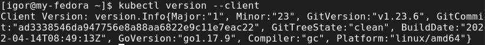
## Get information about cluster
```bash
kubectl cluster-info
```
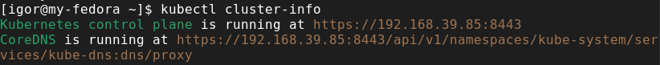
## get information about available nodes
```bash
kubectl get nodes
```
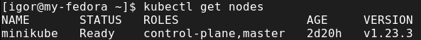
# Install [Kubernetes Dashboard](https://kubernetes.io/docs/tasks/access-application-cluster/web-ui-dashboard/)
```bash
kubectl apply -f https://raw.githubusercontent.com/kubernetes/dashboard/v2.5.1/aio/deploy/recommended.yaml
```
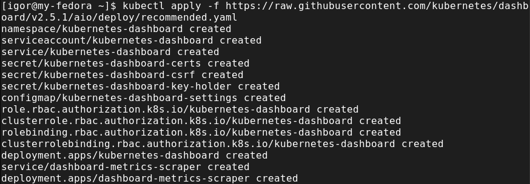
# Install [Metrics Server](https://github.com/kubernetes-sigs/metrics-server#deployment)
```bash
kubectl apply -f https://github.com/kubernetes-sigs/metrics-server/releases/latest/download/components.yaml
```
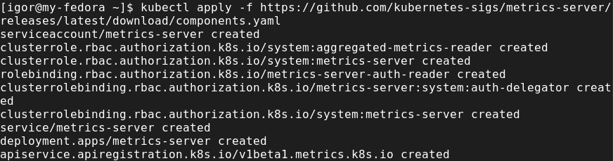
# Connect to Dashboard
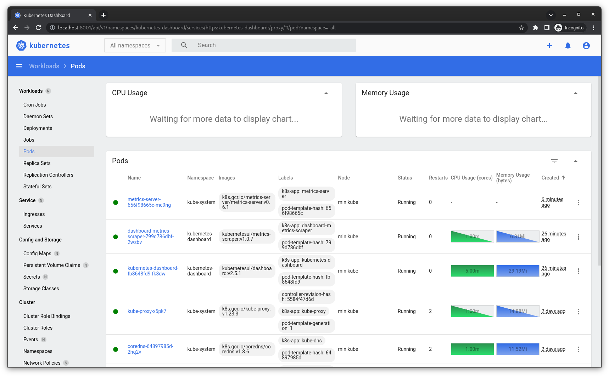
# Task 1.2
# Kubernetes resources introduction
```bash
kubectl run web --image=nginx:latest
```
- take a look at created resource in cmd "kubectl get pods"

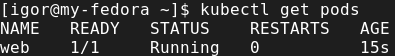
- take a look at created resource in Dashboard

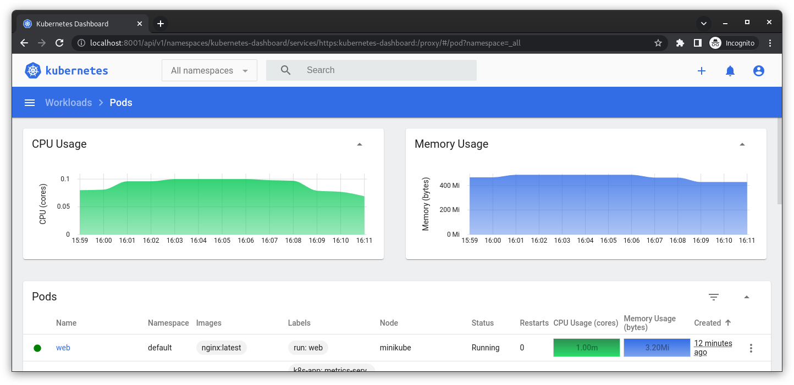
- take a look at created resource in cmd

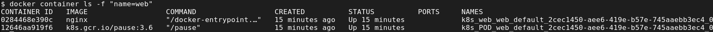

## Apply manifests (download from repository)
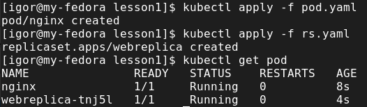

### Homework
* Create a deployment nginx.

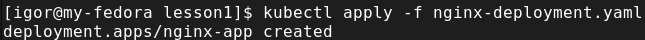
* Set up two replicas.

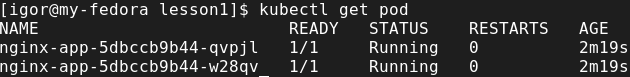
* Remove one of the pods, see what happens.

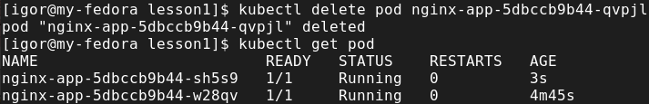

I deleted one pod and k8s created a new one to fulfill replica target