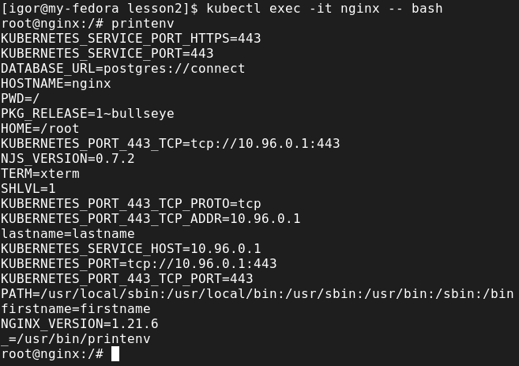
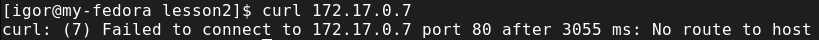
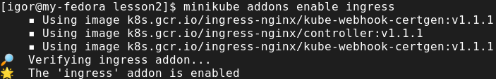

# Task 2
### ConfigMap & Secrets

### Check env in pod

### Create deployment with simple application

### Get pod ip address

* Try connect to pod with curl (curl pod_ip_address). What happens?
* From your PC


* From minikube (minikube ssh)


* From another pod (kubectl exec -it $(kubectl get pod |awk '{print $1}'|grep web-|head -n1) bash)


### Create service (ClusterIP)
Get service CLUSTER-IP


* Try connect to service (curl service_ip_address). What happens?

* From you PC


* From minikube (minikube ssh) (run the command several times)


* From another pod (kubectl exec -it $(kubectl get pod |awk '{print $1}'|grep web-|head -n1) bash) (run the command several times)


### NodePort

### Checking the availability of the NodePort service type

### Headless service

### DNS
Connect to any pod


Compare the IP address of the DNS server in the pod and the DNS service of the Kubernetes cluster.


* Compare headless and clusterip
Inside the pod run nslookup to normal clusterip and headless. Compare the results.
You will need to create pod with dnsutils.


### [Ingress](https://kubernetes.github.io/ingress-nginx/deploy/#minikube)
Enable Ingress controller



Let's see what the ingress controller creates for us


Create Ingress


### Homework
* In Minikube in namespace kube-system, there are many different pods running. Your task is to figure out who creates them, and who makes sure they are running (restores them after deletion).


I used
```bash 
kubectl describe pod -n kube-system kube-apiserver-minikube
```
and found out that it is controlled by
```bash 
Controlled By:  Node/minikube
```
same thing about kube-scheduler-minikube it is "Controlled By:  Node/minikube"

* Implement Canary deployment of an application via Ingress. Traffic to canary deployment should be redirected if you add "canary:always" in the header, otherwise it should go to regular deployment.
Set to redirect a percentage of traffic to canary deployment.

Applied two namespaces prod and canary


configmaps for nginx in corresponding namespaces


services as well


and applied deployments


lastly applied ingress for prod and canary


and checked that it is working with and without canary: always

