# Task 3
### [Read more about CSI](https://habr.com/ru/company/flant/blog/424211/)
### Create pv in kubernetes
```bash
kubectl apply -f pv.yaml
```
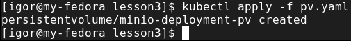
### Check our pv
```bash
kubectl get pv
```
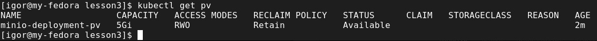

### Create pvc
```bash
kubectl apply -f pvc.yaml
```
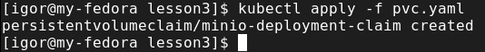
### Check our output in pv 
```bash
kubectl get pv
```
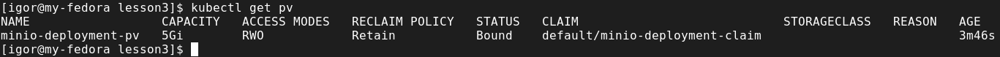

### Check pvc
```bash
kubectl get pvc
```
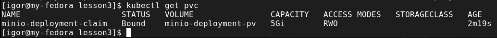
### Apply deployment minio
```bash
kubectl apply -f deployment.yaml
```
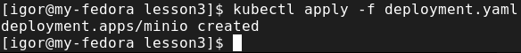
### Apply svc nodeport
```bash
kubectl apply -f minio-nodeport.yaml
```
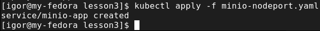

Open minikup_ip:node_port in you browser

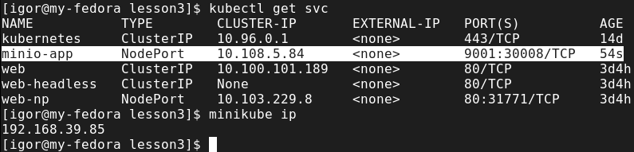
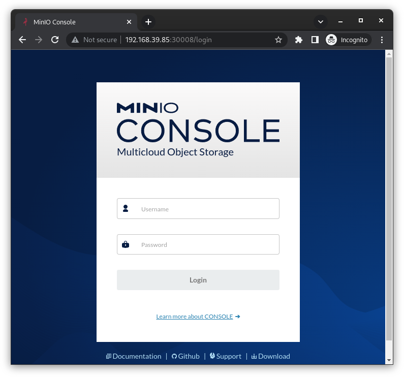
### Apply statefulset
```bash
kubectl apply -f statefulset.yaml
```
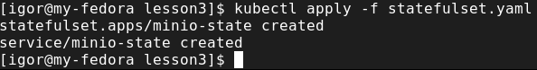
### Check pod and statefulset
```bash
kubectl get pod
kubectl get sts
```
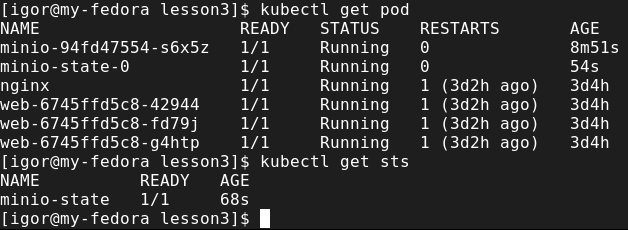
### Homework
* We published minio "outside" using nodePort. Do the same but using ingress.

First i changed port for WEB-UI in statefullset to be 8080

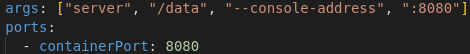

applied it with ingress manifest
```bash
kubectl apply -f homework/
```
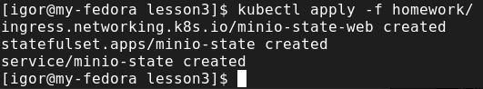

and checked avalability

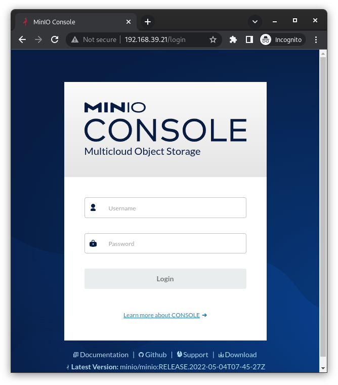
* Publish minio via ingress so that minio by ip_minikube and nginx returning hostname (previous job) by path ip_minikube/web are available at the same time.

I changed ingress configuration and applied it

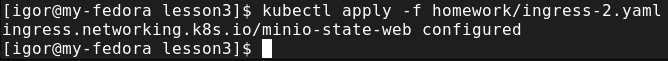

WEB-UI is still available

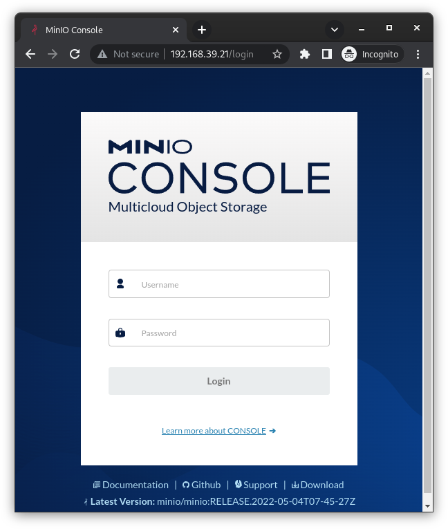

/web path returs hostname

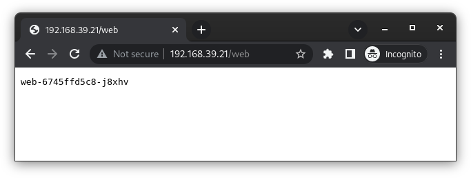
* Create deploy with emptyDir save data to mountPoint emptyDir, delete pods, check data.

Apply deploy

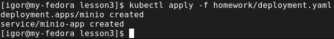

Upload testfile

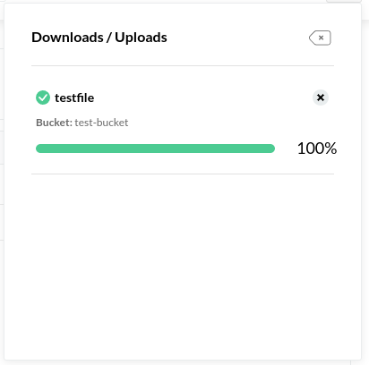

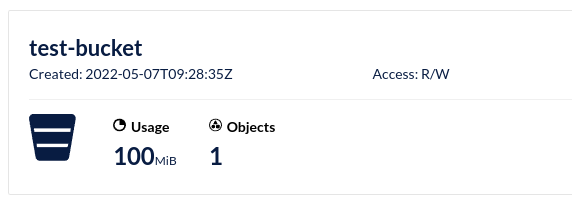

delete pod and new one was created

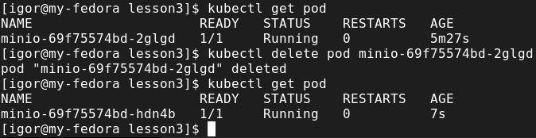

Bucket lost

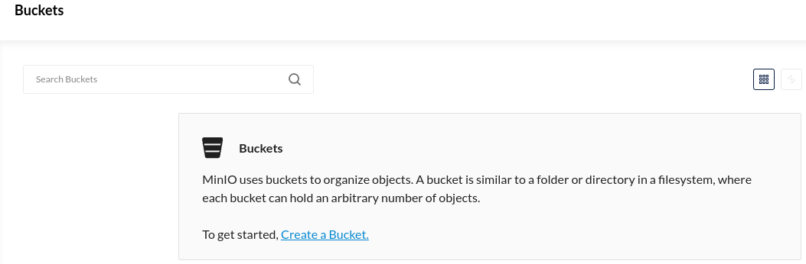

* Optional. Raise an nfs share on a remote machine. Create a pv using this share, create a pvc for it, create a deployment. Save data to the share, delete the deployment, delete the pv/pvc, check that the data is safe.

After export of NFS share I mounted it inside of Minikube

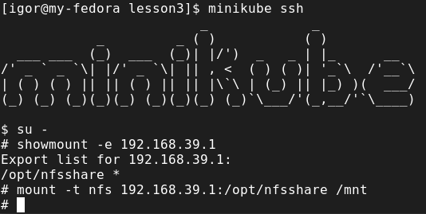

then I applied pv.yaml

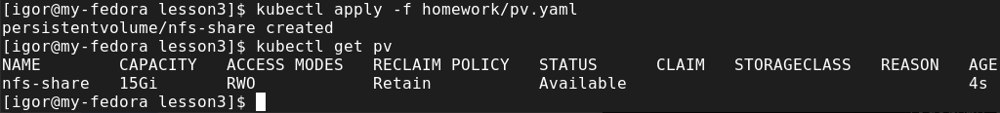

and pvc.yaml and checked that it is bound

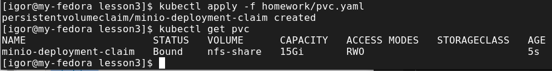

applied deployment-nfs-share.yaml

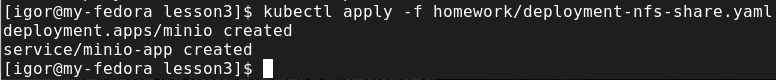

uploaded testfile to bucket again

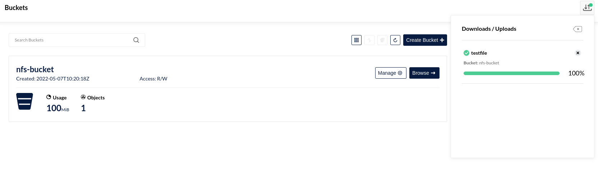

and after deletition of deployment checked my files

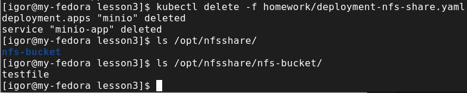