# Task 4
### Check what I can do
```bash
kubectl auth can-i create deployments --namespace kube-system
```
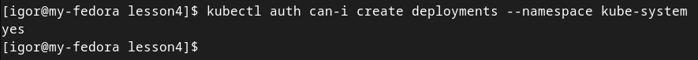

### Configure user authentication using x509 certificates
### Create private key
```bash
openssl genrsa -out k8s_user.key 2048
```
### Create a certificate signing request
```bash
openssl req -new -key k8s_user.key \
-out k8s_user.csr \
-subj "/CN=k8s_user"
```
### Sign the CSR in the Kubernetes CA. We have to use the CA certificate and the key, which are usually in /etc/kubernetes/pki. But since we use minikube, the certificates will be on the host machine in ~/.minikube
```bash
openssl x509 -req -in k8s_user.csr \
-CA ~/.minikube/ca.crt \
-CAkey ~/.minikube/ca.key \
-CAcreateserial \
-out k8s_user.crt -days 500
```
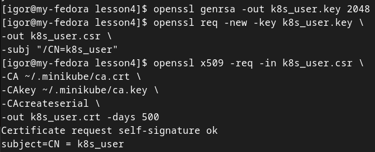
### Create user in kubernetes
```bash
kubectl config set-credentials k8s_user \
--client-certificate=k8s_user.crt \
--client-key=k8s_user.key
```
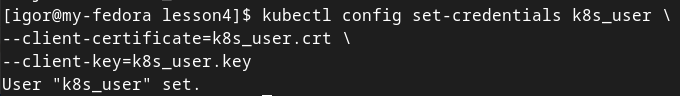
### Set context for user
```bash
kubectl config set-context k8s_user \
--cluster=minikube --user=k8s_user
```
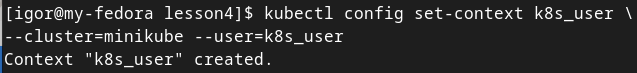

### Switch to use new context
```bash
kubectl config use-context k8s_user
```
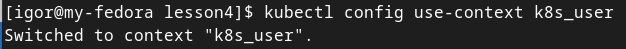
### Check privileges
```bash
kubectl get node
kubectl get pod
```
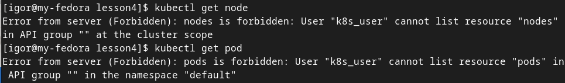
### Switch to default(admin) context
```bash
kubectl config use-context minikube
```
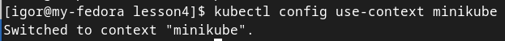
### Bind role and clusterrole to the user
```bash
kubectl apply -f binding.yaml
```
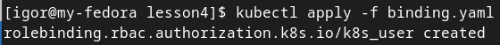
### Check output
```bash
kubectl get pod
```
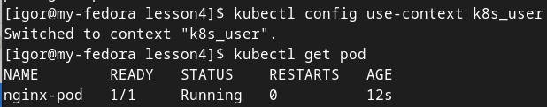


### Homework
* Create users deploy_view and deploy_edit. Give the user deploy_view rights only to view deployments, pods. Give the user deploy_edit full rights to the objects deployments, pods.

Generate key, cert and create deploy-edit user in K8s

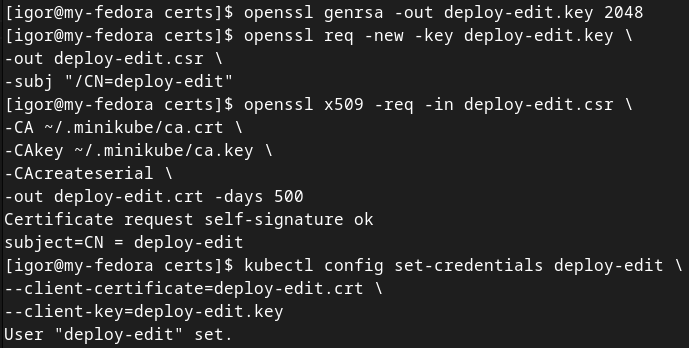

apply deploy-edit role

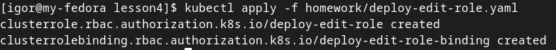

switch to user context

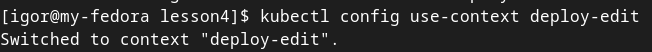

and check permissions

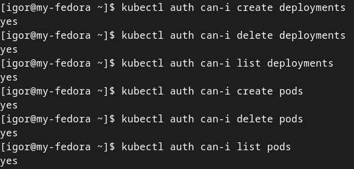

Generate key, cert and create deploy-view user in K8s

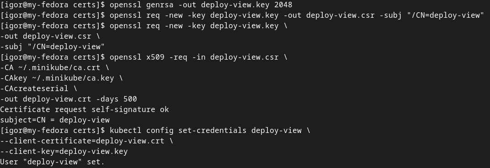

apply deploy-view role

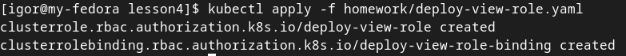

switch to user context

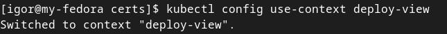

and check permissions

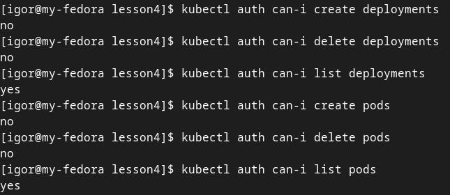

* Create namespace prod. Create users prod_admin, prod_view. Give the user prod_admin admin rights on ns prod, give the user prod_view only view rights on namespace prod.

Namespace

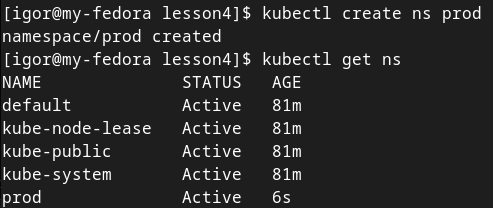

Generate key, cert and create prod-admin user in k8s

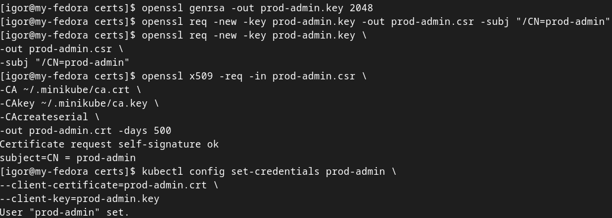

Apply role

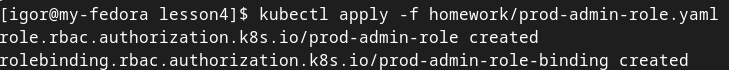

switch to user context

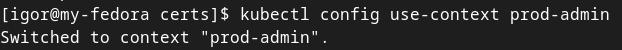

Check permissions with access-matrix cluster scope

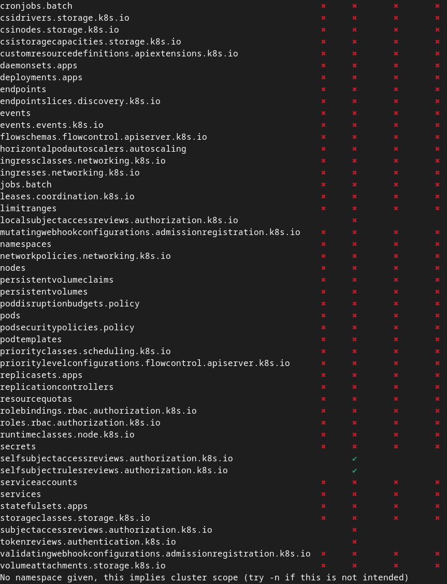

Check permissions with access-matrix in prod namespace

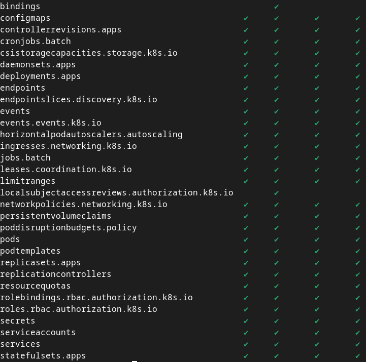

Generate key, cert and create prod-view user in k8s

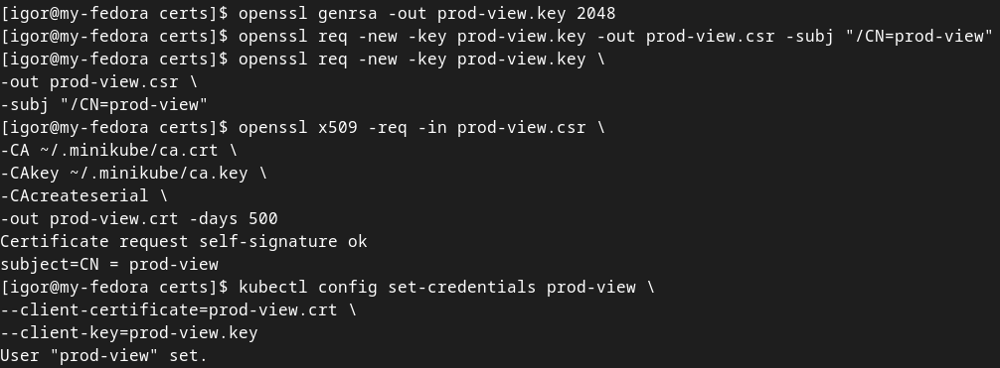

Apply role

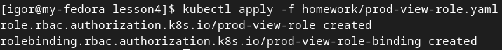

switch to user context

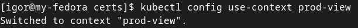

Check permissions with access-matrix cluster scope


Check permissions with access-matrix in prod namespace

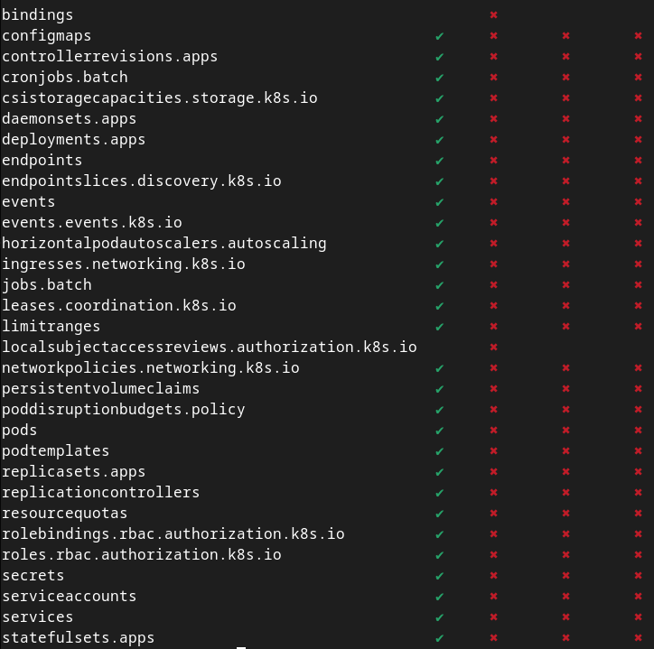

* Create a serviceAccount sa-namespace-admin. Grant full rights to namespace default. Create context, authorize using the created sa, check accesses.

Apply role

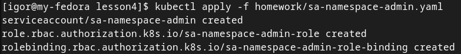

Check permissions with access-matrix cluster scope


Check permissions with access-matrix in default namespace
```bash
kubectl access-matrix --as=system:serviceaccount:default:sa-namespace-admin -n default
```
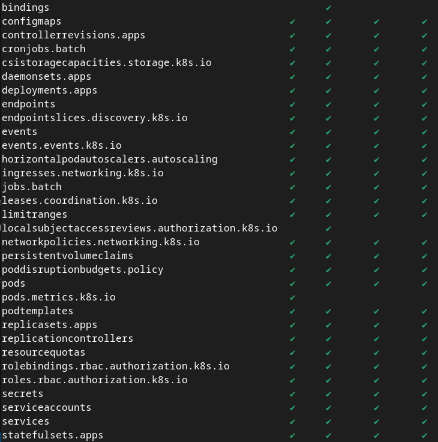

Check what is visible in kubernetes-dashboard:

get a token
```bash
kubectl -n default describe secret $(kubectl -n default get secret | grep sa-namespace-admin | awk '{print $1}')
```
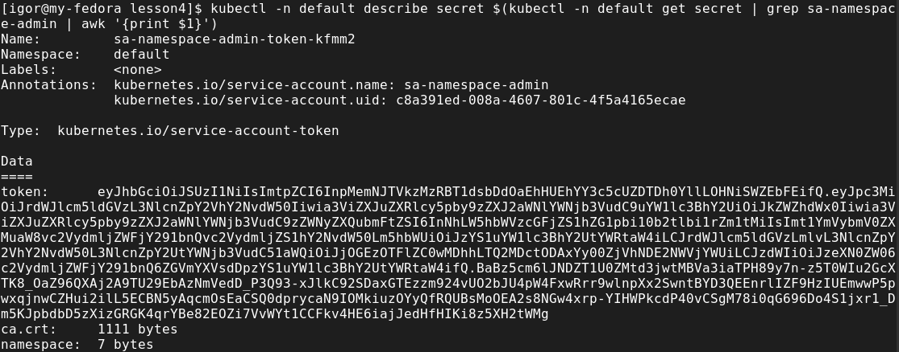

authorize in dashboard with it and check what is visible

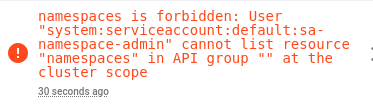

but can see and edit everything in default namespace

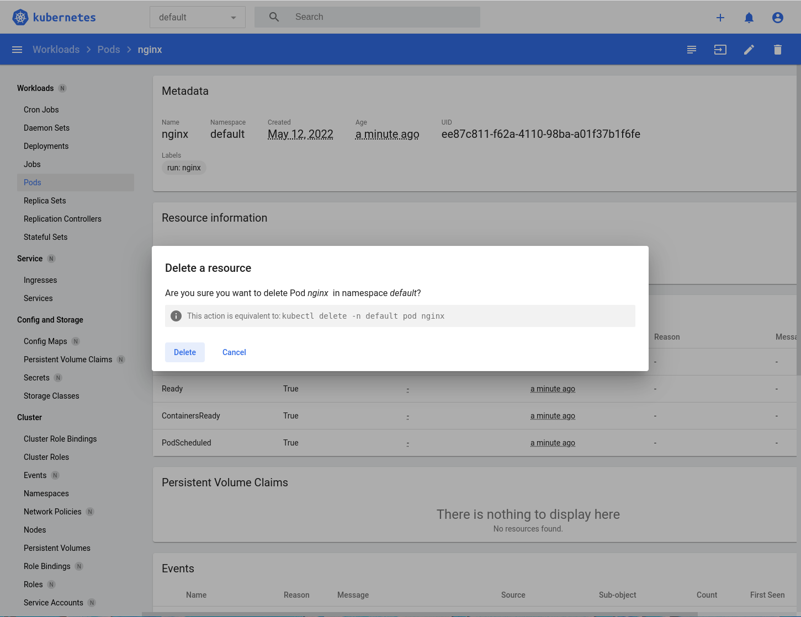